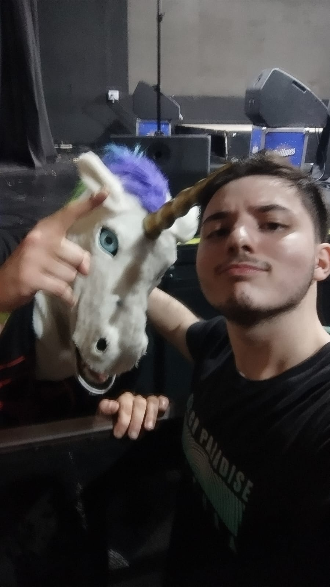

# Una breve descripcion de mi persona

---
<table align="center">
  <tr>
    <td align="center" width="300">
      
       
    </td>
    <td valign="top">
      <h1>Alek Tremoulet</h1>
      <b>Legajo:</b> 209.214-1
      
<i>Estudiante de Ingeniería en Sistemas de Información</i>

      

      <h3>Sobre mí </h3>
      

        Tengo 23 años 
         Disfruto un montón la musica, Estoy la mayor parte del dia escuchando y descubriendo cosas nuevas. Desde dance-pop de chipre hasta rock de finlandia entre otras muchas más. No me gusta la cumbia, reggueton ni el trap del 2013 en adelante. 
      

      

        El de la foto se llama <a href="https://open.spotify.com/intl-es/artist/3NoAERCAeMG0EOGpbpdYLm"> unicorn on ketamine</a>, es un dj de uptempo. Vino la semana pasa al país y no me lo podia perder
      

      

        Tambien me gusta la poesia contemporanea que es basicamente la que se centra en lo inefable mediante el uso de metaforas.
      

    </td>
    
  </tr>
</table>

---

### No es importante en el mundo pero...

> Soy de las personas que cree que cuando le preguntan "¿Que musica te gusta?" y responden con: "me gusta todo" es una respuesta vacia.  
Decir "me gusta de todo" es, en esencia, una respuesta de seguridad. pero que, en el proceso, termina por anular la identidad de uno. En otras palabras estás borrando tus bordes. Si no hay nada que rechaces, entonces no hay nada que realmente te defina. Porque decir "esto sí y esto no" es lo que construye nuestra personalidad.  
La belleza de la música está en el contraste. Apreciamos la calma porque conocemos el caos. Si todo es igual de bueno, entonces nada es especial.

---

  <a href="https://open.spotify.com/user/alek3249?si=a94f934495274659" target="_blank">
  

